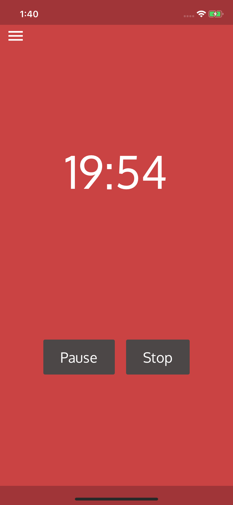

# pomd

> Simple pomodoro timer

## About

A customized fork of [pomodoroexp](https://github.com/expo/pomodoroexp).

## Usage

Get on [expo](https://expo.io/@tiaan/pomd).

## Screenshots

    
    
    

## CLI

Prefer a CLI? Check out [pomd-cli](https://github.com/tiaanduplessis/pomd).

## License

MIT